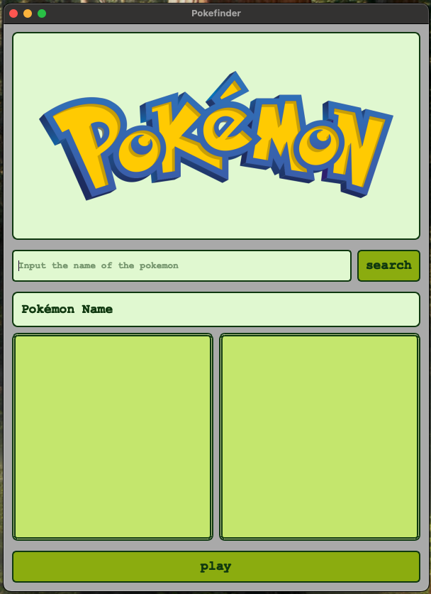
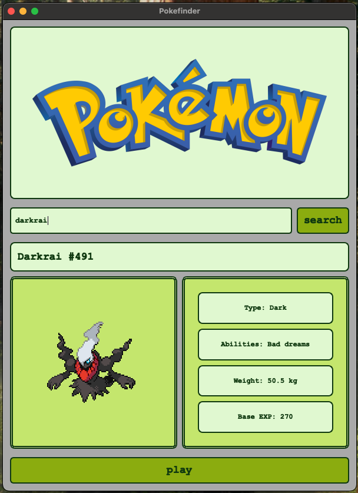

# PythonPokémonFinder

A retro-styled Pokémon lookup app built with PyQt5.  
You can search for any Pokémon by name to view its sprite, stats, type, abilities, and play its original cry — all wrapped in a GameBoy-inspired interface.

---

## 🔍 Features

- 🎨 GameBoy-style UI with pixel-style fonts and borders
- 📦 Fetches real-time Pokémon data from the [PokeAPI](https://pokeapi.co)
- 🖼️ Displays official Pokémon sprite
- 📢 Plays original Pokémon cries (fetched from official PokéAPI `.ogg` links)
- 📊 Shows:
  - Base stats (HP, ATK, DEF, etc.)
  - Types and abilities
  - Weight and base experience
- 🎶 Plays looping background music

---

## 🖼️ Screenshots
<p float="left">
    
    
</p>

---

## 🚀 How to Run

1. Clone the repository:
   ```bash
   git clone https://github.com/yourusername/PokemonFinder.git
   cd PokemonFinder
2. (Optional) Create a virtual environment:
    ```bash
    python3 -m venv .venv
    source .venv/bin/activate
3. Install requirements:
    ```bash
   pip install -r requirements.txt
4. Run the app:
    ```bash
   python main.py

Make sure you have pygame and PyQt5 installed.


---

### ✅ 5. **Project Structure (Optional)**
```markdown
## 📁 Project Structure
├── main.py
├── pokefinder.py
├── dataFetcher.py
├── mainWindow.py
├─├ assets/
│ ├── logo.png
│ └── background.mp3
├── fonts/
└── DS-DIGIT.TTF
```
## 🎵 Assets Notice

This project includes background music and images (e.g. `logo.png`, `background.mp3`) that are **not stored on GitHub** due to file size limitations.

These assets are essential for:

- 🎶 Background music playback
- 🖼️ GameBoy-style logo

> ✅ A download link to the full asset pack will be provided in a future release.

For now, you can:
- Use your own `.mp3` or `.ogg` files by placing them in the `assets/` folder.
- Or remove/comment out the audio/image lines in `pokefinder.py` if you just want to test functionality.

---

### ✅ 6. **Credits**
```markdown
## 🙏 Credits

- [PokéAPI](https://pokeapi.co/) for providing all Pokémon data, sprites, and cries
- Pokémon Showdown team for audio hosting
- GameBoy color palette inspiration

## 🔮 Future Ideas

- Add Pokédex navigation (next/previous)
- Filter Pokémon by generation or type
- Add Pokémon descriptions (flavor text)
- Display shiny versions
